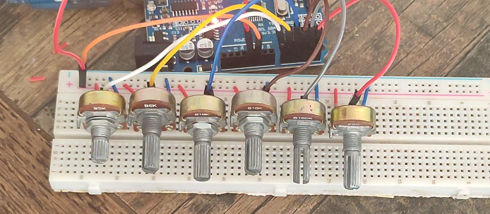
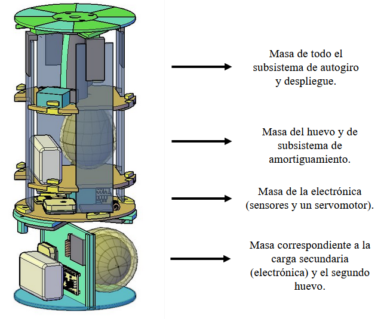
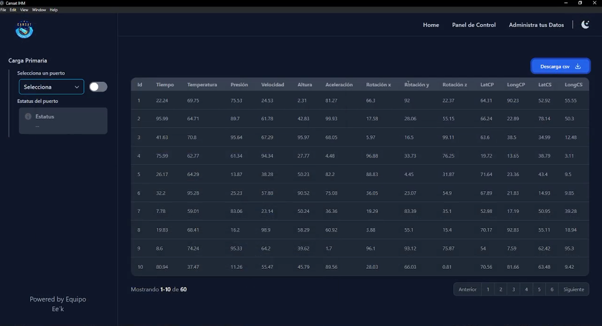
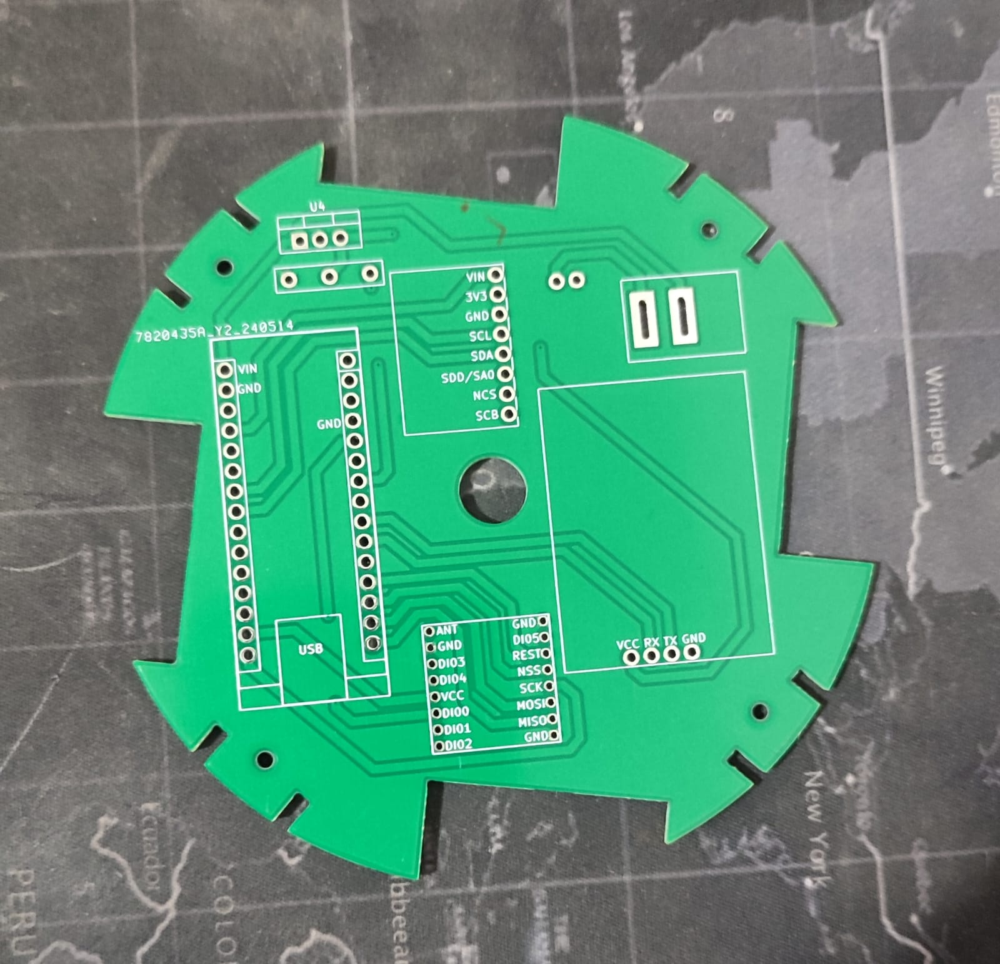
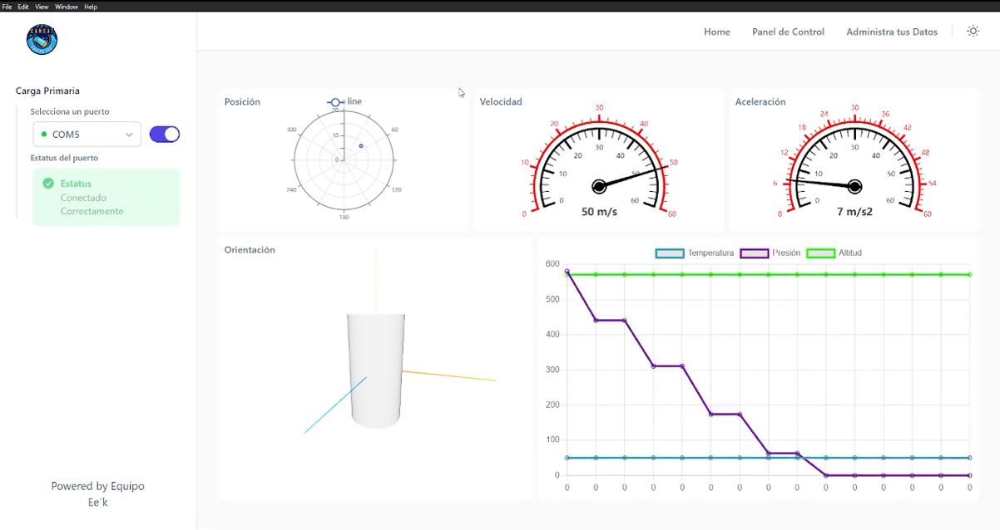

# 🛰️ CanSat IHM – Human-Machine Interface


This project was developed as part of the **Ibero-American CanSat Competition**.  
It is a **desktop application** designed to work as a **ground station** for a CanSat, allowing real-time monitoring, visualization, and storage of telemetry data.

My main role in this project was the **development of the Human-Machine Interface (HMI)**. In addition, I made important contributions to the **telemetry system**, including data communication, sensor handling, and integration between the CanSat and the desktop application.

---

## 🎯 Project Goals

- Monitor telemetry data sent by a CanSat in real time
- Visualize sensor data using charts and simple 3D models
- Connect the CanSat to the ground station using serial communication
- Store important measurements for later analysis

---

## 🧩 Project Structure

The repository is organized into three main parts:

### 1️⃣ Arduino (Embedded Systems)

`arduino_skecthes/`

Contains Arduino sketches for:

- Primary payload
- Secondary payload
- Ground station
- Communication tests (LoRa, serial)
- Sensor tests (IMU, gyroscope)
- Data filtering and JSON transmission

These sketches handle sensor readings, data processing, and data transmission.

---

### 2️⃣ Desktop Backend (Electron)

`main/`

Responsible for:

- Running the Electron main process
- Managing serial communication with the CanSat
- Handling IPC communication between backend and frontend
- Managing the database using Sequelize and SQLite
- Error handling and application configuration

---

### 3️⃣ Frontend (React)

`renderer/`

Includes:

- User interface built with React and Vite
- Real-time charts for telemetry data
- Simple 3D visualization for orientation and movement
- Data tables with export functionality
- Modern UI styling with TailwindCSS

---

## 🛠️ Technologies Used

### Desktop & Backend


### Frontend


### Embedded Systems


---

## 📦 Requirements

- **Node.js 18.20.0**  
  This project requires **Node.js version 18.20.0**, which is specified in the `.npmrc` file.  
  The recommended way to install this version is using **nvm (Node Version Manager)**.  
  The version is fixed because this repository is no longer actively maintained and is kept as a storage and reference resource.

- **npm**  
  npm is installed automatically when using Node.js with nvm.

- **Arduino IDE**  
  Required to upload and modify the Arduino sketches included in the project.

- **A CanSat or Arduino device connected via serial port**  
  Needed to send telemetry data to the desktop application.  
  The project can also be tested using a **basic Arduino setup with potentiometers**, by uploading the example sketches located in the **`arduino_skecthes/`** folder. These sketches simulate sensor data and allow testing the interface without a full CanSat.



---

## ▶️ Installation

Clone the repository:

```bash
git clone https://github.com/your-username/CansatIHM.git
cd CansatIHM
```

Install dependencies:

```bash
npm install
```

🚀 Run in Development Mode

```bash
npm run dev
```

This command:

- Starts the React frontend using Vite

- Launches the Electron desktop application in development mode

## 🏗️ Build the Application

To generate a production build:

```bash
npm run build
```

This will:

- Build the frontend

- Package the Electron application

## 🗃️ Database

The project uses SQLite with Sequelize.

To initialize the database:

```bash
npx sequelize-cli db:migrate
npx sequelize-cli db:seed:all
```

## 📊 Data Flow

- Sensors collect data on the CanSat

- Data is sent to the ground station via serial communication

- Electron backend processes and stores the data

- Frontend displays the data using charts and 3D views

## 🖼️ Project Images

The following images show different stages of the **CanSat project**, including the construction process, hardware setup, testing, and the desktop application used as the ground station.

These images are intended to give a general overview of the project development and the integration between hardware and software.

<div style="display:flex;justify-content:center;align-items:center;flex-wrap:wrap;gap:10px">






</div>

